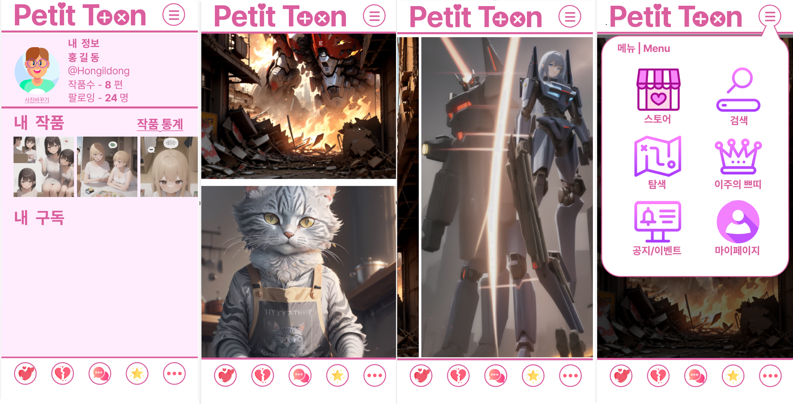

# petit-toon-ui
---  

## **🎨 쁘티툰 프로젝트**  
**📅 2023.07 ~ 2023.09**

**프로젝트 개요**  
- 🖥️ **React 기반 웹툰 뷰어 개발**: 클라이언트 사이드 렌더링(CSR)을 사용하여 웹툰 뷰어를 개발했습니다.
- 🎯 **UI 및 스크롤 성능 최적화**로 사용자 경험을 개선했습니다.

**주요 역할**  
- 👨‍💻 **프론트엔드 개발**: 웹사이트의 프론트엔드 개발과 React 기반의 컴포넌트 구조 설계
- 🚀 **사용자 경험 최적화**: 성능 개선을 통한 원활한 사용자 경험 제공

**기술 스택**  
- React, JavaScript, CSS, HTML

---

### **🏆 주요 성과**  
- ⏳ **페이지 로딩 시간 단축**: Lazy Loading과 Infinite Scrolling을 적용해 로딩 시간을 **2.5초에서 1초 이하**로 감소  
- 🖱️ **스크롤 성능 개선**: React Intersection Observer로 스크롤을 최적화하여 끊김 없는 스크롤 환경 제공  
- 🔍 **검색창 반응 속도 개선**: useMemo와 useCallback 최적화를 통해 검색창 반응 속도를 **220ms에서 100ms**로 단축  

---

### **🧠 문제 해결 과정**  
1. **🔐 로그인 방식 선택**  
   - **도전**: 세션 방식과 확장성을 고민하여 JWT(JSON Web Token) 방식을 선택  
   - **해결**: 클라이언트에서 JWT 토큰을 안전하게 쿠키에 저장하여 보안성과 확장성을 모두 확보  

2. **🖼️ 이미지 로딩 최적화**  
   - **도전**: 초기 이미지 로딩 지연으로 인한 사용자 경험 저하 문제  
   - **해결**: Lazy Loading 및 React Intersection Observer를 사용해 Infinite Scrolling을 구현, 원활한 이미지 로딩과 사용자 경험 제공  
